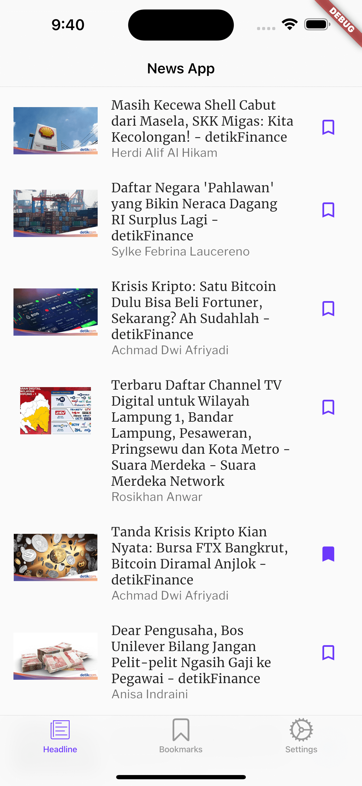
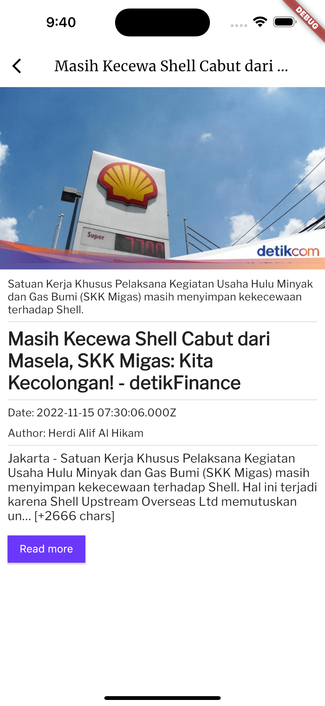
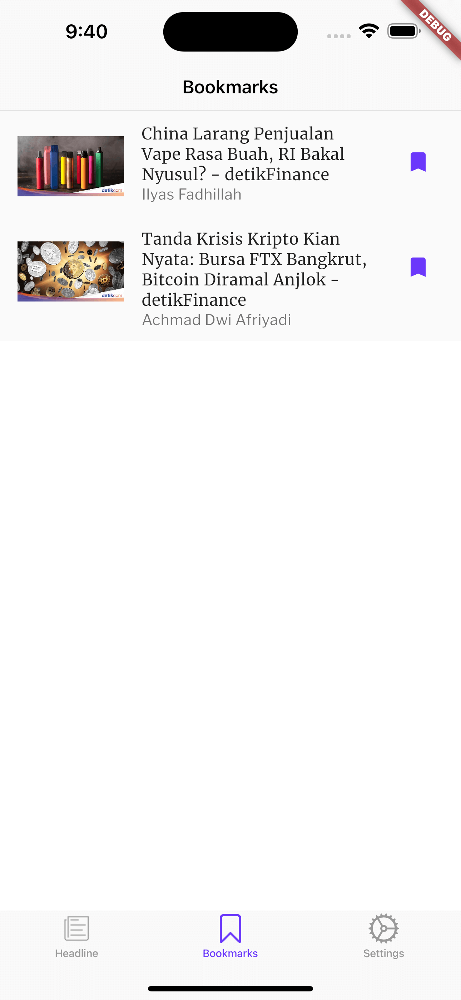
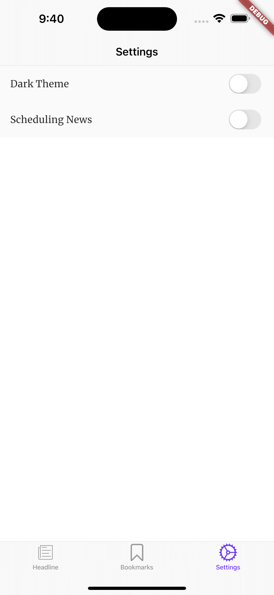

## Description

Projek ini merupakan projek latihan pada kelas [Belajar Fundamental Aplikasi Flutter](https://www.dicoding.com/academies/195), dengan membuat aplikasi portal berita dengan  Pada projek ini mencakup materi-materi seperti :
1. Menampilkan berita dengan mengimplementasikan state management Provider untuk consume API dari endpoint [NewsAPI](https://newsapi.org/)
2. Menampilkan berita setiap hari (Daily Reminder) dengan memanfaatkan notifikasi dan juga mengimplementasikan salah satu library background service.
3. Menambahkan fitur bookmark untuk menyimpan berita dan juga fitur pengaturan tema, dengan menggunakan shared_preferences dan sqflite

## Development Setup

Clone the repository and run the following commands:

```
flutter pub get
flutter run
```

## Source

Dicoding Academy

## Screenshot

 &nbsp;  
 &nbsp;  
